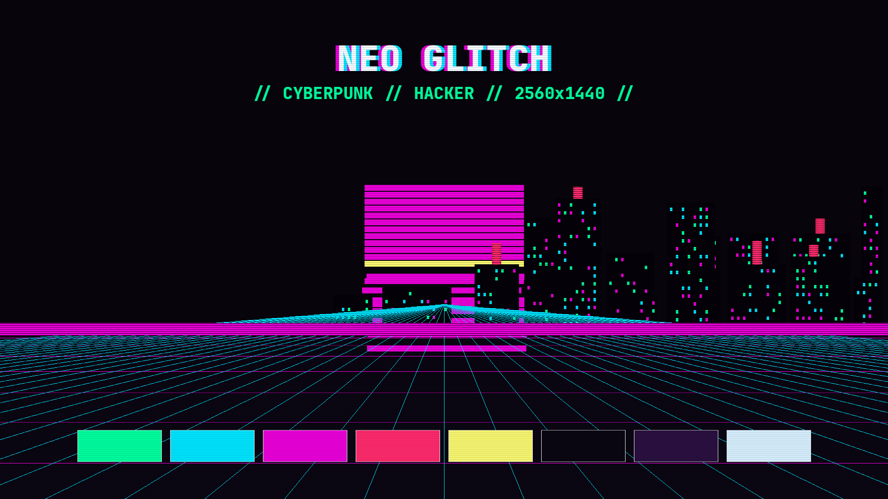

# Neo Glitch — an Omarchy theme

Cyberpunk glitch aesthetics for [Omarchy](https://omarchy.org): RGB-split neon
on void black. Hacker deck, netrunner vibes.



## Install

```bash
omarchy theme install https://github.com/keviedev/omarchy-neo-glitch.git
omarchy theme set neo-glitch
```

## What's inside

- **colors.toml** — the palette. Void black (`#0a0612`) base with neon green
  (`#00ff9f`), cyan (`#00e5ff`), magenta (`#ea00d9`), red (`#ff2a6d`), and
  yellow (`#f9f871`). Everything below derives from it where Omarchy allows.
- **backgrounds/** — four procedurally generated synthwave glitch cities
  (2560x1440): segmented neon sun, perspective grid, digital rain, RGB
  channel-split shearing, CRT scanlines — plus a skull variant where the
  sun is a neon-green ASCII-rendered skull with a magenta ghost copy,
  rising over the same skyline viewpoint. Generated with PIL, no AI, no
  scraping. `omarchy theme bg next` cycles them.
- **ghostty.conf** — reference terminal palette (magenta selection, red
  cursor). Repo-installed themes get this regenerated from `colors.toml`
  (see Notes).
- **btop.theme** — glitch-styled system monitor: per-subsystem neon box
  colors, magenta download / cyan upload graphs.
- **hyprlock.conf** — supplies the lock screen variable colors (black ICE
  input field, magenta frame, green text).
- **hyprland.conf** — focused-window border gradient: green → magenta at 90°.
- **shell.\*.toml** — Omarchy shell section overrides: translucent black bar
  with magenta text and neon green active states, hot magenta interactive
  controls, gradient-framed launcher/menus/popups/notifications, neon lock
  input.
- **keyboard.rgb / icons.theme** — neon green keyboard backlight (OpenRGB
  devices), Yaru-purple icons.
- **gedit-neo-glitch.xml** — optional GtkSourceView scheme for gedit 50
  (libgedit-gtksourceview-300). Drop it in
  `~/.local/share/libgedit-gtksourceview-300/styles/` and select
  "Neo Glitch".
- **neo-glitch.nvim/** — a full matching Neovim colorscheme (void black,
  neon syntax, green cursor on purple CursorLine). Point your LazyVim at it:
  ```lua
  { dir = "~/.config/omarchy/themes/neo-glitch/neo-glitch.nvim", lazy = false, priority = 1000 },
  { "LazyVim/LazyVim", opts = { colorscheme = "neo-glitch" } },
  ```
- **fastfetch/** — a matching fastfetch config: truecolor ASCII skull logo
  (neon green with a magenta ghost offset), neon RGB key colors
  (magenta hardware / cyan software / red system headers). Copy
  `fastfetch/config.jsonc` to `~/.config/fastfetch/config.jsonc` and
  `fastfetch/skull.txt` to `~/.config/fastfetch/neo-glitch/`.
- **tmux/** — a full Neo Glitch tmux status line: neon green session badge
  and active window, cyan host / yellow clock / magenta date chips on the
  right, purple pane borders with green active border. Copy
  `tmux/tmux.conf` to `~/.config/tmux/tmux.conf` (or merge the theme block
  into your own config).
- **branding/** — neo-glitch Omarchy branding graphics: `about.txt` (the
  original Omarchy icon art recolored neon green, shown in the About
  window), `screensaver.txt` (the OMARCHY wordmark recolored in a
  green → cyan → magenta gradient for the ttfx screensaver), and
  `avatar-1024.png` (a matching GitHub profile avatar generated from the
  skull art). Installed to `~/.config/omarchy/branding/` by the theme-set
  hook.
- **sddm/** — a Neo Glitch fork of the Omarchy SDDM login theme (void-black
  background, neon OMARCHY logo). Install with
  `sudo bash sddm/install.sh` — copies the theme to
  `/usr/share/sddm/themes/neo-glitch` and switches SDDM to it. The logo is
  the stock Omarchy logo recolored with a green → cyan → magenta gradient.

## Starship prompt

A matching `neo-glitch` starship palette (magenta → red → cyan → green →
yellow segments on void black) is in [starship-palette.toml](starship-palette.toml).
Drop the palette block into `~/.config/starship.toml` and set
`palette = 'neo-glitch'`. Segment structure inspired by
[Deoxizn's omarchy-space-bound-theme](https://github.com/Deoxizn/omarchy-space-bound-theme)
— thanks for the inspiration, Devi!

## Notes

- `omarchy theme install` regenerates terminal configs and Lua from
  `colors.toml` (themes cloned from a repo can't ship code), so the custom
  ghostty palette is applied via your own ghostty config:
  `config-file = "~/.local/state/omarchy/current/theme/ghostty.conf"`.
- The preview and backgrounds are PNG, generated locally with
  Pillow — regenerate with a different seed for new city variants.

## Credits

- Starship prompt segment structure inspired by
  [omarchy-space-bound-theme](https://github.com/Deoxizn/omarchy-space-bound-theme)
  by **Devi** (Deoxizn).

## License

MIT